<h1 align=center>Final Project</h1>

### 1. Basics
---
 

#### **Read**

In the screenshot below, we can see that the program reads a file and returns the correct XOR result. In the first output, we can see that when the block_size * block_count is greater than the file size, the entire file is read. In all the other cases, block_size * block_count bytes of data is read.

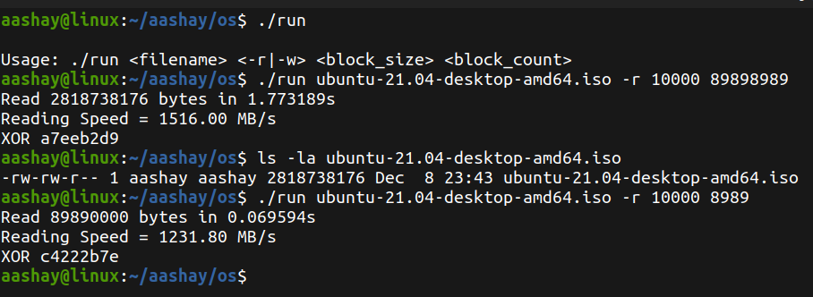  

#### **Write**

Here, we write the data to the output file name specified in the arguments. The data written is block_size * block_count bytes.

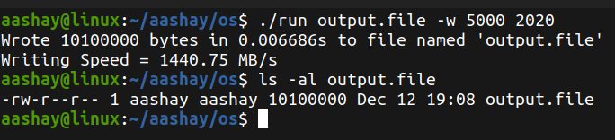

### 2. Measurement
---

In order to find a reasonable time, I keep reading the file one block count at a time until default reasonable time of 6s is reached.

I have also added the ability to pass the time argument from the command time in case you want the time to be something other than the default 6s.

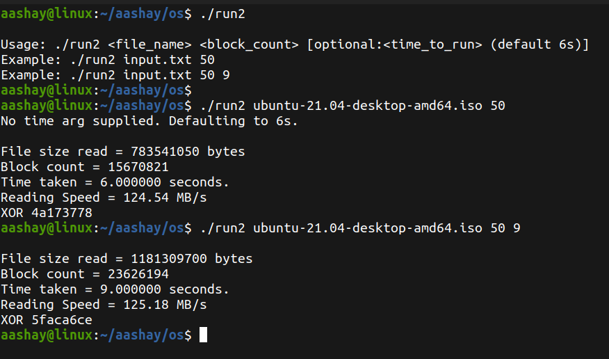

In the above screenshot, I ran my program with no time argument and it outputted the block count read in 6s. The second time I ran it for 9 seconds.

### 3. Raw performance
---
In the screenshot from part 1, we can see that the program outputs the speed in MB/s.

In order to measure the raw performance, I ran the program 30 times while varying the block sizes from 5000 to 150000 in increments of 5000. Below is the graph showing the performance.

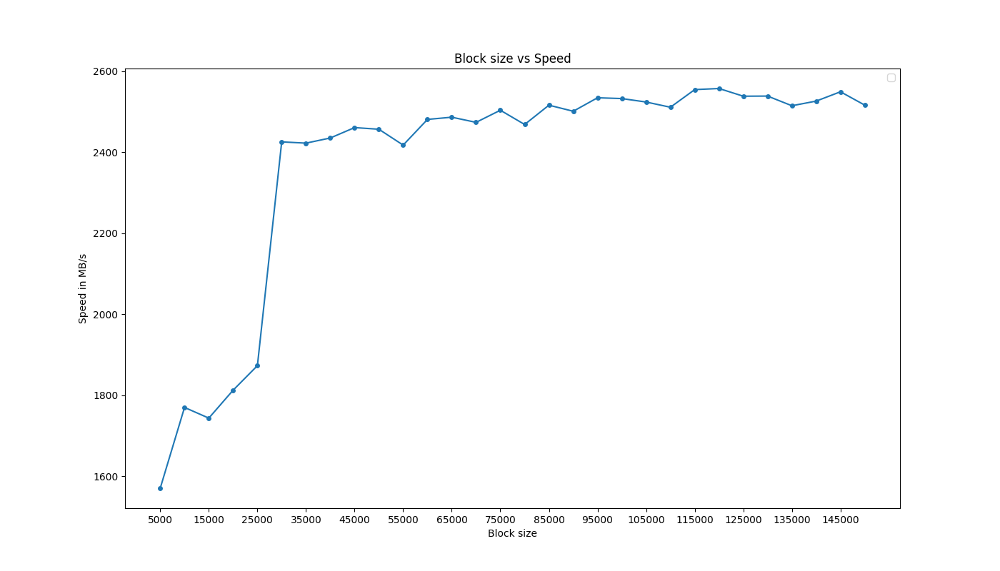

We can see that we achieved the best results when the block size was 100000 and there was no significant improvements in speed thereafter.

### 4. Caching
---

In the screenshot below we can see that the cached performance is obviously better than non-cached performance.

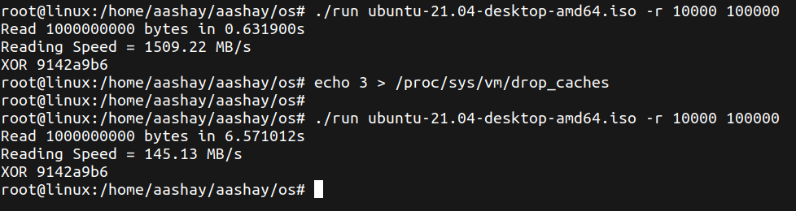  

I again ran the program 30 times while varying the block sizes from 5000 to 150000 in increments of 5000. Here, in case of non-cached performance, I cleared the cache before every run. Below is the graph showing the cached and non-cached performance.

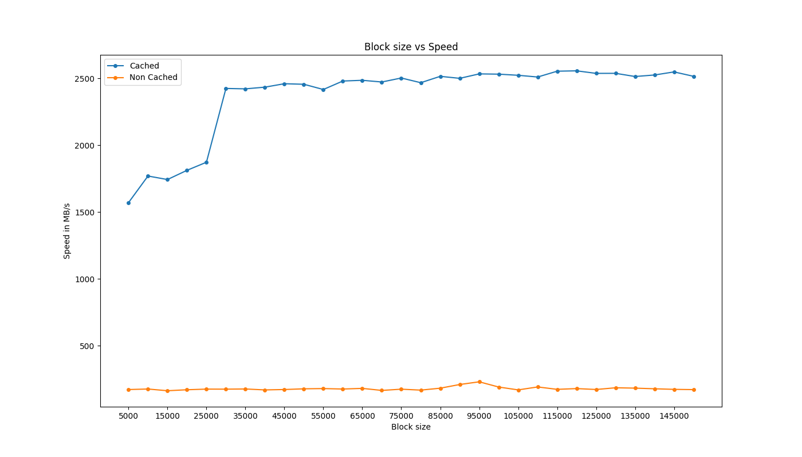

**Extra Credit :** We echo 3 to drop caches because 3 will free slamobjects including dentries and inodes as well as pagecache. If we echo 1 it only frees pagecache. If we echo 2 it only frees slamobjects. Hence, we echo 3 to free both.

### 5. System Calls
---

I wrote a program to count the number of system calls made in the time period specified. Here, I am using a block size of 1 and running the program for 1 second. 

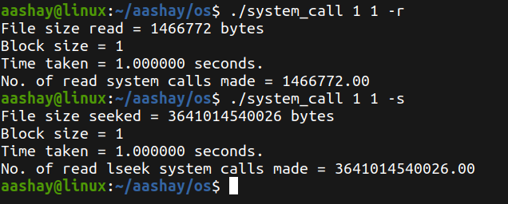

In the screenshot above we can see that because lseek is a lot less expensive than read system call.

Below is the graph comparing the number of system calls made against the time in seconds.

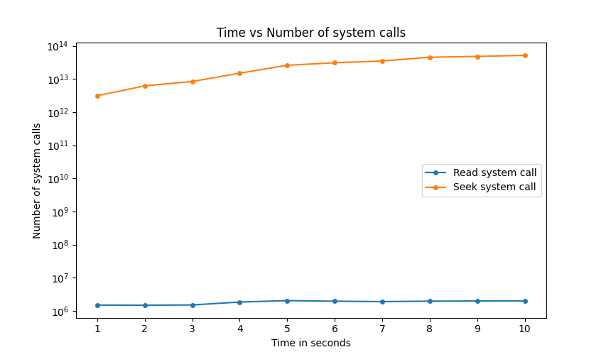

### 6. Raw Performance
---

In order to optimize my program, I used threads to read the file. The logic behind this was the number of blocks to be read will be equally divided between the number of threads.

    Eg: block count = 10 and thread count = 2 then every thread will read 5 blocks.

In case the block count is not equally divided between the threads, the left over blocks are alloted to the last thread.

    Eg: block count = 11 and thread count = 2 then 1st thread will read 5 blocks and 2nd thread will read 6 blocks.

Every thread will start reading from the offset thread_id\*block_size\*block_count and will read block_size\*block_count bytes.

    Eg: If block_size = 5 and block_count = 10.
    Thread id 0 will start from offset 0 and will read 5*10 = 50 bytes. That is index 0 to 49.
    Thread id 1 will start from 1*5*10 = 50 and will read 5*10 = 50 bytes.

In case the value of block_count*block_size if greater than the entire file to be read:
- First, the file size is divided by the block_size to find the block_count.
- Then the block_count is divided between the threads using the same method explained above.

In the screenshot below, we can see that my program fast that uses threads gives us a significantly better reading speed.

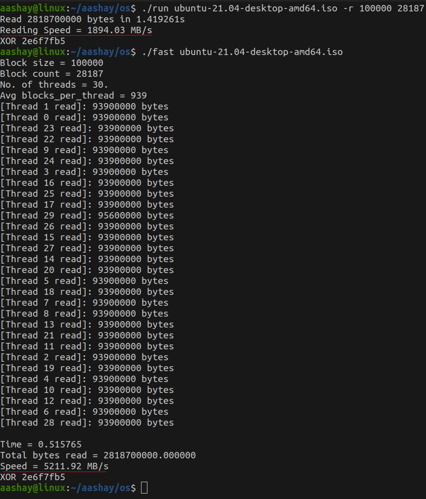

I have also added the options to specify the block size, block count and the number of threads in case you want to play around and test things on your system.

By default, the block size is set to <u>**100000**</u>, because in the diagram in part 2, we can see that I got one of the best reading speed at this block size. The block count is set to 28187 and the number of threads is set to <u>**30**</u>. Because on my system, this combination would give the best results.

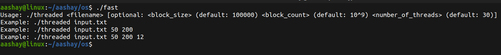  

In the graph below, I have compared the reading speeds for cached and non cached versions against the number of threads. We can see that I got the best reading speed when my thread count was 30, hence the default value is 30.

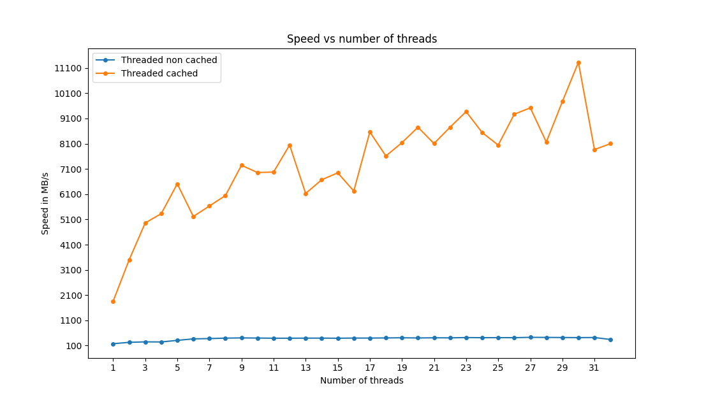